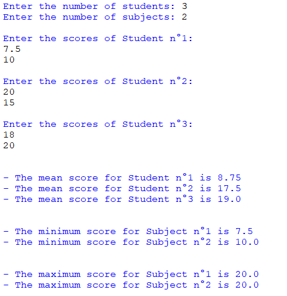

## Description
This program allows users to input academic scores for multiple students across various subjects. The program calculates and displays essential statistics, including the mean score for each student and the minimum and maximum scores for each subject based on the entered scores.

## Features:
- Input scores for multiple students in different subjects.
- Calculate mean score for each student.
- Determine the minimum and maximum scores for each subject.
  
## Usage:
1. Enter the number of students and subjects when prompted.
2. Input scores for each student across different subjects.
3. View the calculated statistics for mean scores of students and the minimum and maximum scores for each subject.

## Note:
Ensure to provide valid numerical inputs for accurate score calculations.

## Example:

